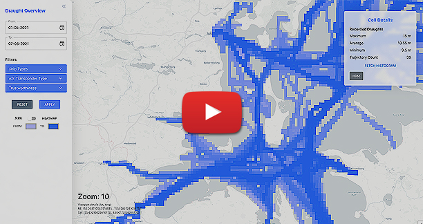

# AIS-Data-Warehousing-and-Bathymetric-Analysis &middot; [](https://github.com/your/your-project/blob/master/LICENSE)

 <p align="center">
     <a href="https://www.youtube.com/" target="_blank">
         
     </a>
 </div>

> Click on the picture above to see a small demonstration of the system on **Youtube**


## Prerequisites

To run the application, the following languages or packages need to be satisfied

- PostgreSQL v14
- Python v3.10
- PostGIS v3.2
- Node v14+


## Getting Started

Start by cloning the repository to your desired folder. For this example, we assume the project resides on the `C:/` drive.

We have provided an argument based main file in which many of the ETL operations can be run directly from the terminal. Below you can see which arguments currently are supported

*  `-i` Initialization of the Data Warehouse if it does not exist already
* `-sd <DD/MM/YYYY>` For ETL processes you can specify the start date for data processing
* `-ed <DD/MM/YYYY>` For ETL processes you can specify the end date for data processing
*  `-l` Performs data loading on data specified by the `-ed` and `-sd` arguments
* `-c` Performs data cleaning on data specified by the `-ed` and `-sd` arguments
* `-cr` Combination of data loading and cleaning based on the `-ed` and `-sd` arguments

To run one of the operations, you will have to navigate to the `P10--ETL` folder and in the terminal run the `scripts/main.py` file with any of the arguments.


### Setting up the application properties

Before running the ETL operations it is important to properly setup the application properties so that the correct authentication and methods are provided to the application. Start by opening the the `application.properties` file in the root directory. Below we have listed all properties with a describtion, to see an example you can look at the file uploaded to the repository.

```
[Database]
hostname= // Hostname for the database connection
dbname= // Name of database to be initialized or used
dbuser= // Name of the root user that have priviliges
dbpass= // Password for the root user
ipadress= // IP Address used if SSH connection is enabled

[Audit]
source_system= // Audit source field 
elt_version= // Audit ELT version field
comment= // Default comment field

[Environment]
connect_via_ssh= // Enable of disable SSH connection
FILE_PATH= // Path to data folder
SSH_PATH= // Path to public key for SSH connection purpose

[Map]
rows= // Number of rows for our grids used when calculating a cell_id 
columns= // Number of columns of our grids used when calculating a cell_id 
southwestx= // Coordinates used for calculating cell_id
southwesty= // Coordinates used for calculating cell_id
```


### Initializing the Data Warehouse

To initialize the data warehouse, navigate to the `P10--ETL` folder and run the following command:

```console
admin:~$ python scripts/main.py -i
```

This operation will create a new database based on the details in the application properties. 


### Running ETL processes

Before running any ETL process please make sure your AIS data follow the naming convention: `aisdk-YYYY-MM-DD.csv'` and that you have provided a correct path to the data in the appliaction properties. 
[Click on this link to downlod the AIS data used in this example](https://web.ais.dk/aisdata/aisdk-2022-06-07.zip)

### Perform loading and cleaning 

After initialization have finished we can load and clean the AIS data by running the following command;

```console
admin:~$ python scripts/main.py -sd 07/06/2022 -ed 07/06/2022 -l -cr
```

This will run the ETL processes and when it has finished the data will be available in the data warehouse.


### Starting the API and Frontend

To start the API you navigate to the `P10--api` folder and run the following command in the terminal:

```console
admin:~$ flask run
```

This will start the API locally running on port 5000 (default).


To start the frontend navigate to the `P10--frontend` and run the following commands in the terminal:

Download all dependencies:

```console
admin:~$ npm install
```

Start the frontend

```console
admin:~$ npm start
```

A new browser window will open when compiled with your local adress on port 3000, e.g., `http://localhost:3000`


If everything was setup properly you will now be able to query on areas where you have data available in the data warehouse.
